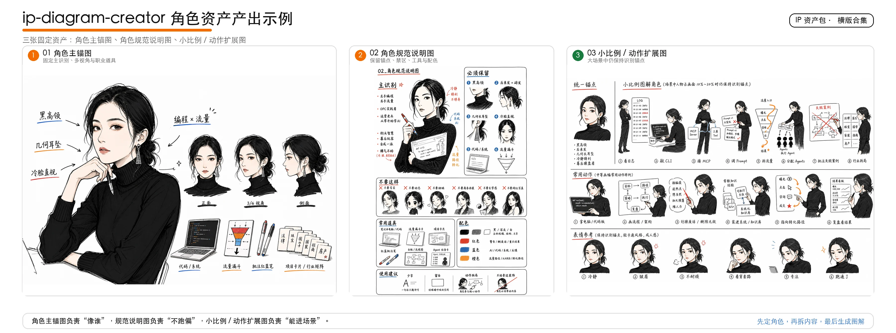
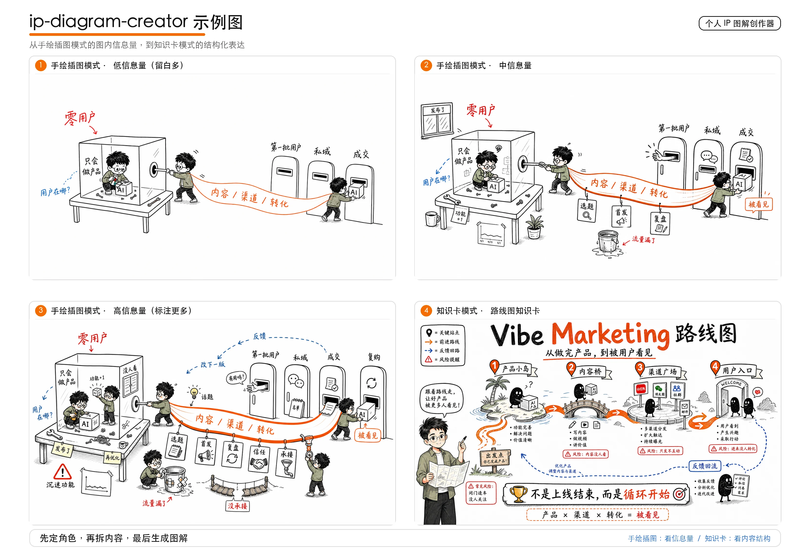
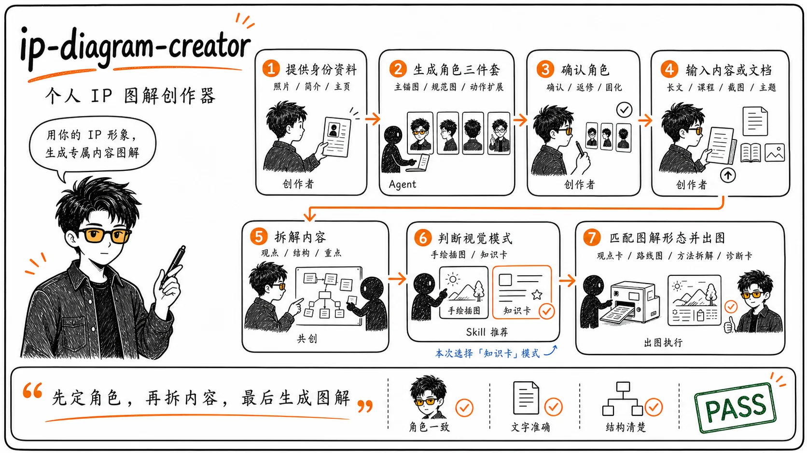
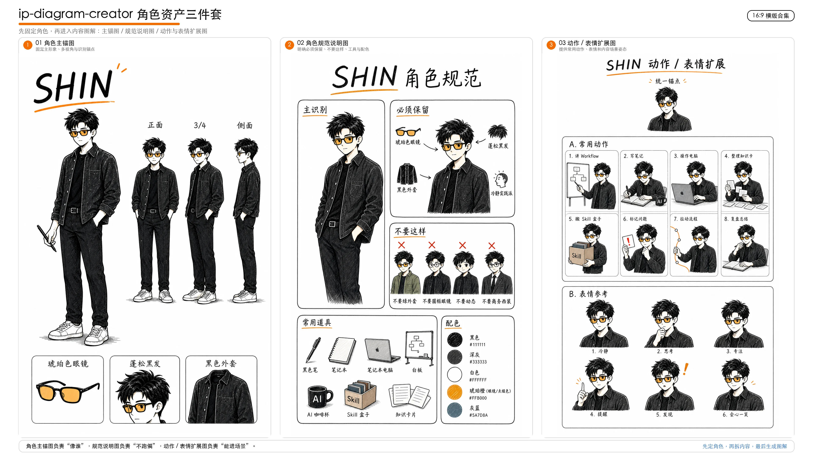
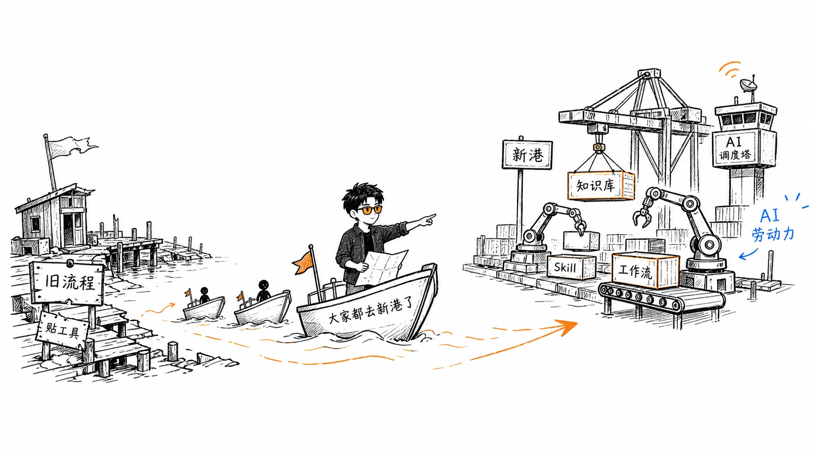

# ip-diagram-creator

**个人 IP 图解创作器：用你的 IP 形象，生成专属内容图解。**

把授权照片、主页截图、简介或已有角色档案，转成一套可长期复用的极简手绘图解角色；再把文章、课程、观点或脚本拆成适合传播的长文配图、知识卡、方法拆解图或手机海报。

底层原则：**先定角色，再拆内容，最后生成图解。**


## 快速开始

如果你已经把本 Skill 安装到支持 Skills 的 Agent 中，可以直接这样开始：

```text
我想做一个自己的极简手绘图解角色。我会发本人照片和主页截图，请先帮我提取信息，生成角色信息提取卡和三张角色固定资产 prompt。
```

角色确认后，再输入内容：

```text
我已经确认了角色。现在这篇文章想配图，请先帮我判断适合几张图，给 shot list，不要直接全生成。
```

可按你的 Agent / Skill 管理器支持的方式安装。例如：

```bash
npx skills add https://github.com/haloshin/ip-diagram-creator
```

不使用安装器也可以：下载本仓库，把整个目录放进你的 Agent Skills 目录，然后让 Agent 读取 `SKILL.md`。

## 你会得到什么

### 角色资产：三张固定资产



角色资产不是只生成一张头像，而是先固化“像谁”，再固化“不能跑偏”，最后固化“小比例场景里还能认出来”。

### 图解产出：从低信息量插图到知识卡



这张图展示同一个内容主题在不同信息密度下的产出差异：低信息量手绘插图、中信息量插图、高信息量标注图，以及更适合收藏和复盘的知识卡。

- **角色三件套**：角色主锚图、角色规范说明图、动作 / 表情 / 小比例场景扩展图。
- **内容图解**：先读长文、课程、截图或一句话主题，再判断适合画哪几张图。
- **模式判断**：手绘插图看信息量，知识卡看内容结构。
- **出图前确认卡**：先确认图类型、尺寸、图内文字、主画面隐喻和角色动作。
- **Prompt 和返修建议**：可直接复制到图像生成工具，也方便持续迭代角色稳定性。

## 适合谁

- 个人 IP、知识型创作者、课程作者、咨询顾问、内容团队。
- 想把自己的形象变成长期稳定内容视觉的人。
- 想让 AI 先理解内容结构，再推荐图解形式，而不是直接套模板出图的人。

## 不能做什么

- 不保证复刻真人长相，也不适合生成身份证照、商业肖像照或高拟真写真。
- 不直接使用未授权照片、他人主页截图、私信截图、客户资料或不可分发参考图。
- 不替代商标、肖像权、平台规则、课程销售和广告投放前的人工审核。
- 不把用户确认后的私有角色资产放进公共 Skill 包作为默认资产。

## 输入和输出

**输入材料**

- 角色材料：本人照片、头像、主页截图、简介、账号资料、已有角色图、角色档案。
- 内容材料：长文、Markdown、链接摘要、截图、课程大纲、视频脚本、直播主题、案例复盘、一句话观点。
- 参考材料：你有权使用的风格参考、知识卡参考、版式参考。

**输出内容**

- 角色信息提取卡。
- 三张角色固定资产的 prompt 或生成建议。
- 角色档案摘要和后续引用优先级。
- 长文 shot list。
- 出图方案推荐。
- 内容确认卡。
- 可复制的图像生成 prompt。
- QA 检查和返修 prompt。

## 示例图库

示例图只展示最终成品，不包含原始照片、主页截图或私有参考图。

<details>
<summary>展开查看 4 类示例图</summary>

<table>
  <tr>
    <td width="50%">
      
      <br />
      <strong>工作流总览</strong><br />
      从个人材料到内容图解的完整链路。
    </td>
    <td width="50%">
      
      <br />
      <strong>角色资产</strong><br />
      角色主锚、动作场景、道具和使用建议如何固化。
    </td>
  </tr>
  <tr>
    <td width="50%">
      
      <br />
      <strong>手绘插图模式</strong><br />
      画面更空，用一个大场景隐喻解释一个核心观点。
    </td>
    <td width="50%">
      
      <br />
      <strong>知识卡模式</strong><br />
      内容更完整，把观点、路径、风险和行动放进一张可读卡片。
    </td>
  </tr>
</table>

</details>

PNG 源图和 WebP 展示图都保留在 `assets/examples/gallery/`，便于后续替换、裁切或重新压缩。

## 文件结构

```text
ip-diagram-creator/
├── README.md
├── SKILL.md
├── LICENSE
├── CHANGELOG.md
├── .gitignore
├── assets/
├── references/
├── examples/
└── evals/
```

- `README.md`：给人看的项目首页。
- `SKILL.md`：给 Agent 看的核心工作流。
- `references/`：角色建档、内容拆解、视觉模式、prompt 和 QA 规则。
- `examples/`：真实使用方式示例。
- `evals/`：关键验收用例。
- `assets/`：README 图片和可公开示例图。

## 自定义

你可以按自己的项目改这些文件：

- `references/visual-language.md`：调整手绘风格、颜色、禁区和角色规则。
- `references/modes-and-sizes.md`：增加平台尺寸、内容类型和知识卡形态。
- `references/prompt-templates.md`：替换 prompt 语言或适配你的图像生成模型。
- `assets/README.md`：规划你自己的通用参考图和版式示例。
- `evals/evals.json`：增加你的真实使用场景测试。

## 隐私和素材边界

- 只使用你本人、你的品牌账号，或你已经获得明确授权的照片和截图。
- 如果截图里有他人头像、昵称、联系方式或私信内容，先打码或裁掉。
- 不要把用户确认后的私有角色资产发布进公共 Skill 包。
- 不要上传身份证件、住址、联系方式、后台截图、私密聊天记录或无关人员照片。
- 从平台、课程、社媒或设计网站看到的图，不要直接放进仓库。
- 如果输出图片要用于商业宣传、课程销售或广告投放，先确认肖像权、商标和平台规则。

## 致谢

本项目的白底手绘正文配图流程、先理解内容再生成 shot list 的思路，受到 Ian Xiaohei Illustrations 启发：

- [helloianneo/ian-xiaohei-illustrations](https://github.com/helloianneo/ian-xiaohei-illustrations)

本项目在此基础上做了面向个人 IP 角色资产的改造：增加角色三件套、照片 / 主页截图授权边界、个人角色资产与公共参考图分离、知识卡模式判断和素材安全边界。

该致谢仅表示设计灵感来源，不代表原项目作者参与、维护或背书本项目。请同时尊重原项目的 License、说明和视觉资产边界。

## 贡献

欢迎贡献更清晰的说明、新的内容模式、更稳的 prompt 模板、更多 eval 用例，或不含私有素材的公开示例图。

提交前请确认没有个人隐私、真实客户资料、内部路径、不可公开参考图、截图或品牌资产。
